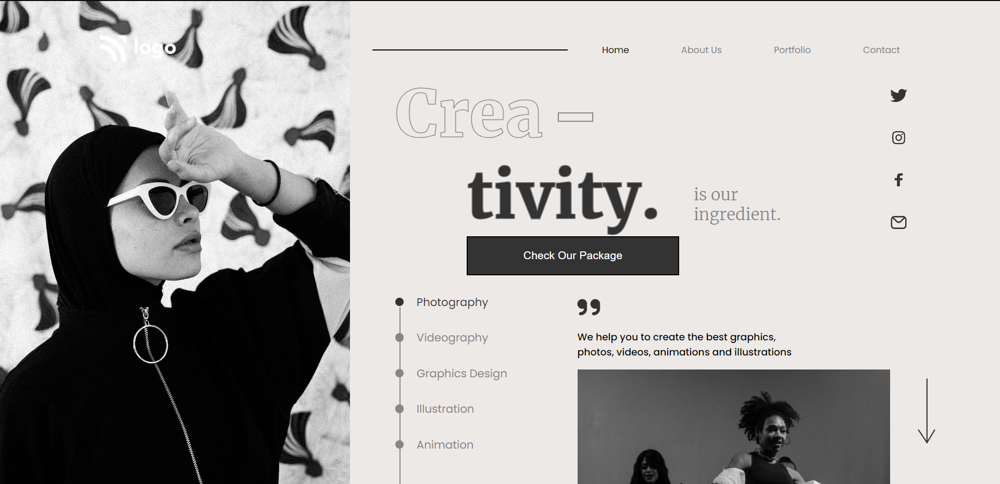

# Assignment 1

## Project 14 [Live Link](https://dance-og.netlify.app)

-   Skills Gained in this project
    -   Learned to use text-stroke-width to style the text.
    -   Learned a lot about relative & absolute.

---

## Time taken to finish this project

-   Approximately 12-14 hour taken to complete this one.

#### Screenshot

